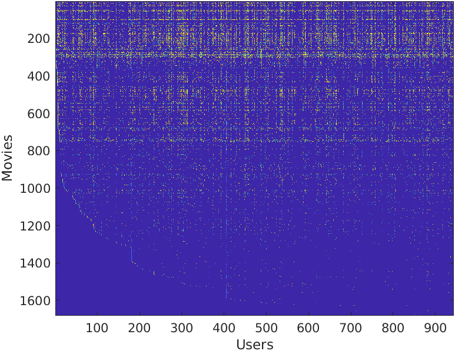

# Day 43 - Movie Recommendation System

### Project Description
Build a recommender system for movies using collabrative filtering. The collaborative filtering learning algorithm is applied to a dataset of movie ratings. The objective of collaborative filtering is to predict movie ratings for the movies that users have not yet rated.

### Movie ratings dataset

The [dataset](https://grouplens.org/datasets/movielens/) `movies.mat` consists of ratings on a scale of 1 to 5. The ratings matrix Y is visualized by plotting it with `imagesc`.

     
###### Figure 1: Visualization of ratings matrix

Y is a 1682 x 943 matrix, containing ratings (1 - 5) of 1682 movies on 943 users.

### Collaborative filtering learning algorithm
The collaborative filtering algorithm in the setting of movie recommendations considers a set of n-dimensional parameter vectors x(1),..., x(nm) and
&theta;(1),..., &theta;(nu), where the model predicts the rating for movie i by user j as y(i,j) = (&theta;(j))T x(i). Given a dataset that consists of a set of ratings produced by some users on some movies, the task is to learn the parameter vectors  x(1),..., x(nm) and &theta;(1),..., &theta;(nu) that produce the best fit (minimizes the squared error).

#### Collaborative filtering cost function
The function `cofiCostFunc.m` returns the regularized cost in the variable J.

#### Collaborative filtering gradient
The function `cofiCostFunc.m` returns the regularized gradient in the variables `X_grad` and `Theta_grad`.

After you have computed the gradients, the a gradient check is run using `checkCostFunction`to numerically check the implementation of the gradients. The function creates a  small collaborative filering problem to check the cost function and gradients. If the implementation is correct, the analytical and numerical gradients match up closely.

### Learning movie recommendations
After implementing the collaborative filtering cost function and gradient, start training your algorithm to make movie recommendations for yourself. The list of all movies and their number in the dataset can be found listed in the file `movie_idx.txt`.
After the additional ratings have been added to the dataset, the the collaborative filtering model is trained to compute the ratings for all the movies and users and displays the movies that it recommends.
Visualizing the data and Model Representation

### Project Structure 

`colabfilter.m` - Octave/MATLAB script to set up the dataset for the problem and make calls to user-defined functions.

User-Defined Function files

* `movies.mat` - movie review dataset
* `movieParams.mat` - Parameters for debugging
* `movie_ids.txt` - List of movies

1. `checkCostFunction.m` - Gradient checking for collaborative filtering
1. `computeNumericalGradient.m` - Numerically compute gradients
1. `fmincg.m` - Function minimization routine (similar to fminunc)
1. `loadMovieList.m` - Loads the list of movies into a cell-array
1. `cofiCostFunc.m` - Implement the cost function for collaborative filtering
1. `normalizeRatings.m` - Mean normalization for collaborative filtering

### How to run?
You can run project either in `octave` or `MATLAB`. 
1. Clone repository using `git clone `
2. `cd` to project directory and either run following command in `octave` or `MATLAB`
2. `run('colabfilter.m')` to run this project

### Where to find help?
* If you do not have Octave installed, please refer to the installation instructions on the [Octave Download](https://www.gnu.org/software/octave/download.html) official site.
* At the Octave/MATLAB command line, typing `help` followed by a function name displays documentation for a built-in function. For example, `help plot` will bring up help information for plotting. Further documentation for Octave functions can be found at the [Octave documentation pages](https://octave.org/doc/v5.2.0/). 
* MATLAB is a proprietary software but see if your school/university has a [MATLAB campus license](https://in.mathworks.com/academia/tah-support-program/eligibility.html). 
* MATLAB documentation can be found at the [MATLAB documentation pages](https://in.mathworks.com/help/matlab/?refresh=true).

