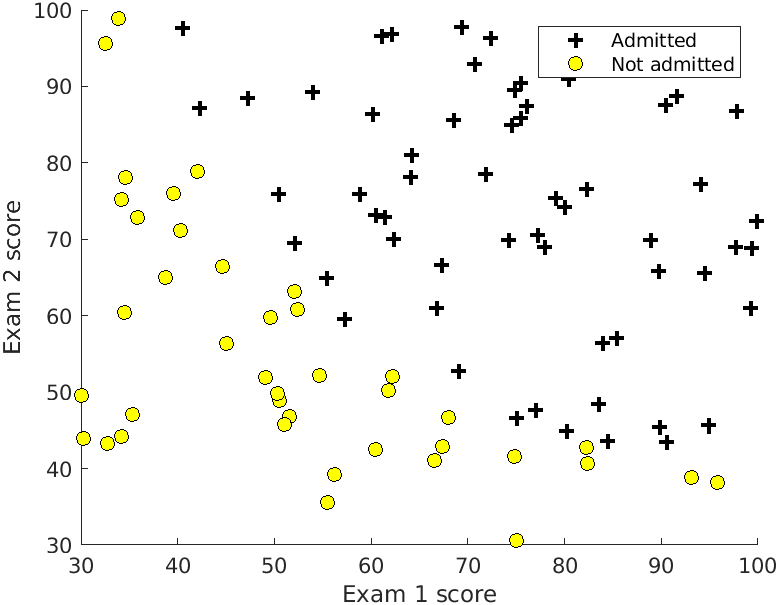
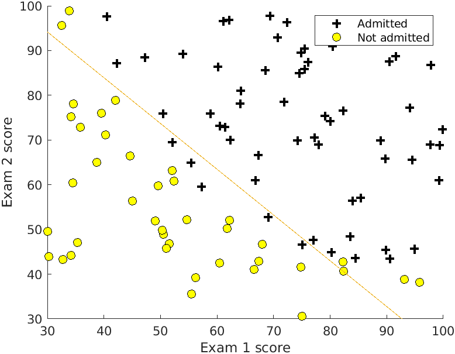

# Day 11 - Logistic Regression Project 1

### Project Description

In this project, I built a logistic regression model to predict each applicant's chance of admission in a university based on their results on two exams. have historical data from previous applicants that you can use as a training set for logistic regression. For each training example, we have the applicant's scores on two exams and the admissions decision. Your task is to build a classification model that estimates an applicant's probability of admission based the scores from those two exams. 

### Plotting the Data
Before starting to implement any learning algorithm, it is often useful to understand the data by visualizing it. For this dataset, I have used a scatter plot to visualize the data. In `student_admission_prediction.m`, the dataset is loaded from the data file `studentdata.txt` and then the script calls the `plotData` function to create a scatter plot of the data.

##### Figure 1- Scatter Plot of training data

### Gradient Descent - Method 1
Next, I implemented the cost function and gradient for logistic regression. I found the optimal parameters of a linear regression model by implementing gradent descent. I wrote a cost function and calculated its gradient, then took a gradient descent step accordingly. The script calls the file `costFunction.m` to implement the algorithm.

### Gradient Descent - Method 2
This time, instead of taking gradient descent steps, I used a MATLAB built-in function called `fminunc`. MATLAB's `fminunc` is an optimization solver that finds the minimum of an unconstrained function. Concretely, using `fminunc` to find the best optimal parameters for the logistic regression cost function, given a fixed dataset (of X and y values).

The final value of (&theta;) was then used to plot the decision boundary by calling the file `plotDecisionBoundary.m ` on the training data, resulting in the figure below.

##### Figure 2- Training data with decision boundary

### Evaluating logistic regression
To evaluate the quality of the parameters we have found is to see how well the learned model predicts on our training set. The script calls the file `predict.m`. The `predict` function will produce '1' or '0' predictions given a dataset and a learned parameter vector (&theta;). Then proceed to report the training accuracy of the classifier by computing the percentage of examples it got correct. 
