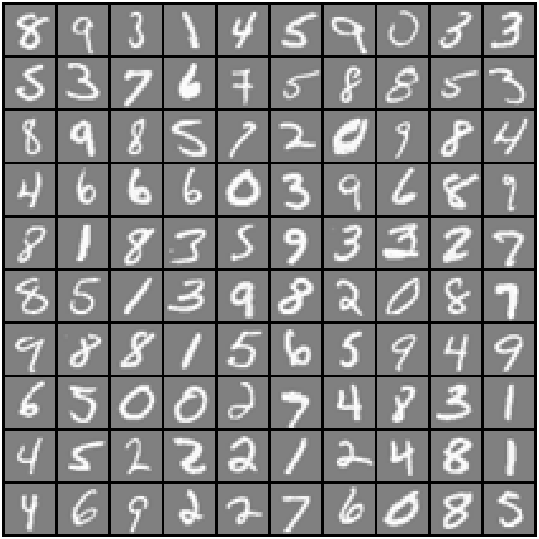
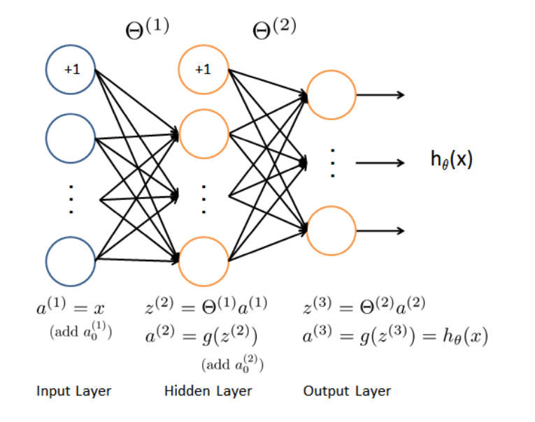
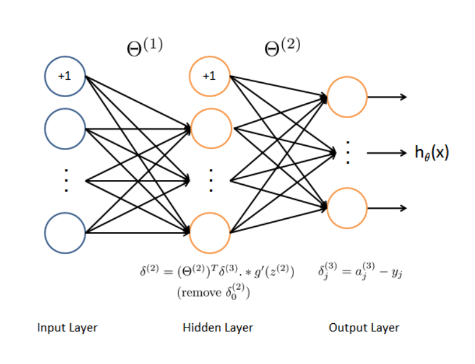

# Day 21 - Neural Network using backpropagation Project 2 (Handwriting Recognition)

### Project Description
Implementing backpropagation algorithm to learn the parameters for the neural network to recognize hand-written digits.

The file `data1.mat` contains the dataset for the above neural network problem. The dataset is a subset of the [MNIST handwritten digit dataset](http://yann.lecun.com/exdb/mnist/) that contains 5000 training examples of handwritten digits.
The `weights.mat` contsains the parameters of the neural network.

### Visualizing the data and Model Representation
Before starting on any task, it is often useful to understand the data by visualizing it. For this dataset, load and display the data on a 2-dimensional plot by calling the function `displayData`.

###### Figure 1- Display 100 examples from the dataset

The neural network has 3 layers (an input layer, a hidden layer and an output layer). Since the images are of size 20 x 20, this gives us 400 input layer units. 
The parameters (Theta1 and Theta2) have dimensions that are sized for a neural network with 25 units in the second layer and 10 output units (corresponding to the 10 digit classes).

### Feedforward and Regularized Cost Function
Implementing the cost function and gradient for the neural network in `nnCostFunction.m` to return the cost.

###### Figure 2- Display 100 examples from the dataset

### Backpropagation
Implementing the backpropagation algorithm to compute the gradient for the neural network cost function so that the `nnCostFunction.m` returns an appropriate value for `grad`.
After computing the gradient, the neural network is trained by minimizing the cost function using advanced optimizer `fmincg`.
#### Sigmoid gradient
First implemented the sigmoid gradient function and called `sigmoidGradient.m`
#### Random initialization
When training neural networks, it is important to randomly initialize the parameters for symmetry breaking. The `randInitializeWeights.m` initializes the weights to small values.

###### Figure 3- Display 100 examples from the dataset
#### Gradient Checking
Implemented the function to compute the numerical gradient in `computeNumericalGradient.m`. `handwriting_recognition_3.m` will run the provided function `checkNNGradients.m`
which will create a small neural network and dataset that will be used for checking the gradients. If the backpropagation implementation is correct, the relative difference should be less than 1e-9.

### Visualising the hidden layer
One way to understand what the neural network is learning is to visualize what the representations captured by the hidden units. To visualize is to reshape the 400 dimensional vector into a 20 x 20 image and display it. This is done by using the `displayData` function and it will show an image (similar to Figure 4) with 25 units, each corresponding to one hidden unit in the network. In the trained network, the hidden units corresponds roughly to detectors that look for strokes and other patterns in the input.

###### Figure 4- Visualisation the hidden layer

### Project Structure 

`handwriting_recognition_3.m` - Octave/MATLAB script to set up the dataset for the problem and make calls to user-defined functions.

User-Defined Function files

* `data1.mat` - Training set of hand-written digits
* `weights.mat` - Neural network parameters 

1. `displayData.m` - Function to help visualize the dataset
1. `sigmoid.m` - Sigmoid function
1. `fmincg.m` - Function minimization routine (similar to fminunc)
1. `computeNumericalGradient.m` - Numerically compute gradients
1. `checkNNGradients.m` - Function to help check your gradients
1. `debugInitializeWeights.m` - Function for initializing weights
1. `predict.m` - Neural network prediction function
1. `sigmoidGradient.m` - Compute the gradient of the sigmoid function
1. `randInitializeWeights.m` - Randomly initialize weights
1. `nnCostFunction.m` - Neural network cost function

### How to run?
You can run project either in `octave` or `MATLAB`. 
1. Clone repository using `git clone `
2. `cd` to project directory and either run following command in `octave` or `MATLAB`
2. `run('handwriting_recognition_3.m')` to run this project

### Where to find help?
* If you do not have Octave installed, please refer to the installation instructions on the [Octave Download](https://www.gnu.org/software/octave/download.html) official site.
* At the Octave/MATLAB command line, typing `help` followed by a function name displays documentation for a built-in function. For example, `help plot` will bring up help information for plotting. Further documentation for Octave functions can be found at the [Octave documentation pages](https://octave.org/doc/v5.2.0/). 
* MATLAB is a proprietary software but see if your school/university has a [MATLAB campus license](https://in.mathworks.com/academia/tah-support-program/eligibility.html). 
* MATLAB documentation can be found at the [MATLAB documentation pages](https://in.mathworks.com/help/matlab/?refresh=true).

