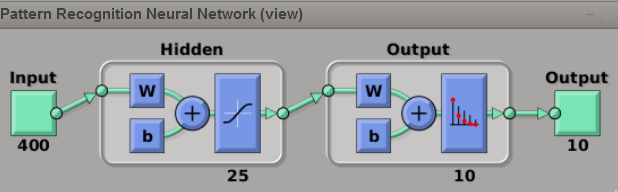
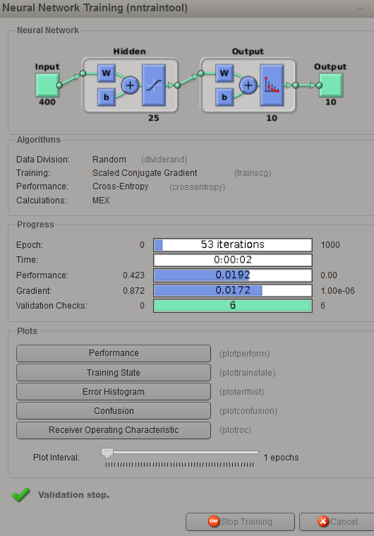
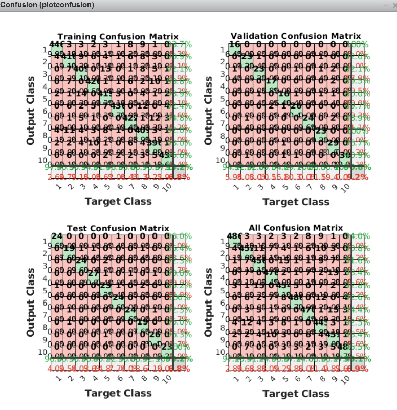

# Day 22 - Neural Network using Pattern Recognition App MATLAB Project 2 (Handwriting Recognition)

### Project Description
Use the Neural Net Pattern Recognition App from the Neural Network Toolbox  in MATLAB to build and train a neural network for hand-written digit recognition.

The file `data1.mat` contains the dataset for the above neural network problem. The dataset is a subset of the [MNIST handwritten digit dataset](http://yann.lecun.com/exdb/mnist/) that contains 5000 training examples of handwritten digits.

### Creating a Pattern Recognition Network using `nprtool`
or Launch Neural Network Start app using `nmstart` and choose the pattern recognition app

###  Training a digit classifier using the Pattern Recognition App
* Open the Pattern Recognition App and select the data
  1. In the Welcome page, read the information about the pattern recognition network uses and structure,then click Next.
  2. In the Select Data page, select X from the Inputs list, select Y from the Targets list, and select 'Matrixrows' for the sample orientation, then click 'Next'.
  3. In the Validation and Test Data page, select 5% for 'Validation' and 'Testing' and click 'Next
* Create and train the network
  1. In the Network Architecture page, enter '25' for the 'Number of Hidden Neurons' and click 'Next'.
  

###### Figure 1 - Nueral Network Training Model Architecture

  2. In the Train Network page, click the 'Train' button. The Neural Network Training Tool app will automatically open and train network. When the training is finished, several plots are available forinspection which provide information on the training and performance of the network model in the 'Plots' section of the Neural Network Training Tool.
  

###### Figure 2 - Network Training tool window after training


###### Figure 3 - Confusion 

  3. Close the Neural Network Training Tool, return to the Pattern Recognition App, and click 'Next'.
* Evaluate and export the network
 After creating and training the network, there are available options for visualizing the network's performance andmaking adjustments if needed. Once the network is performing well, export it. `pattern_recognition.m` is the script generated for building and training similar networks. 
 
 ### Predict digits using the trained network variable
 Run the `handwriting_recognition_4.m` to estimate the class of a random example using the network variable you trained above,compare with the true class, and display the corresponding image using the trained network.
 
 


 Output: ```True class: 7  |  Predicted class: 7 | Probability of match: 90.6% ```
 
 ### Train a custom network with regularization
 The local function for building and training a pattern recognition network `imageNet` at the end of this script, when called, it will build, train, and return neural network model variable which can be usedfor classifying digit images. Since `imageNet` is a local function, it can only be called from inside the script `handwriting_recognition_4.m`. The training accuracy is then displayed for comparison with the previous results. 
 
 Output: ```Training accuracy: 95.6% ```

### Project Structure 

`handwriting_recognition_4.m` - MATLAB script to set up the dataset for the problem and make calls to user-defined functions.

User-Defined Function files

* `data1.mat` - Training set of hand-written digits
* `pattern_recognition.m` - MATLAB script generated by the pattern recognition app MATLAB


### How to run?
You can run project either in `MATLAB`. 
1. Clone repository using `git clone `
2. `cd` to project directory and either run following command in `MATLAB`
2. `run('handwriting_recognition_4.m')` to run this project

### Where to find help?
* At the MATLAB command line, typing `help` followed by a function name displays documentation for a built-in function. For example, `help plot` will bring up help information for plotting. 
* MATLAB is a proprietary software but see if your school/university has a [MATLAB campus license](https://in.mathworks.com/academia/tah-support-program/eligibility.html). 
* MATLAB documentation can be found at the [MATLAB documentation pages](https://in.mathworks.com/help/matlab/?refresh=true).


