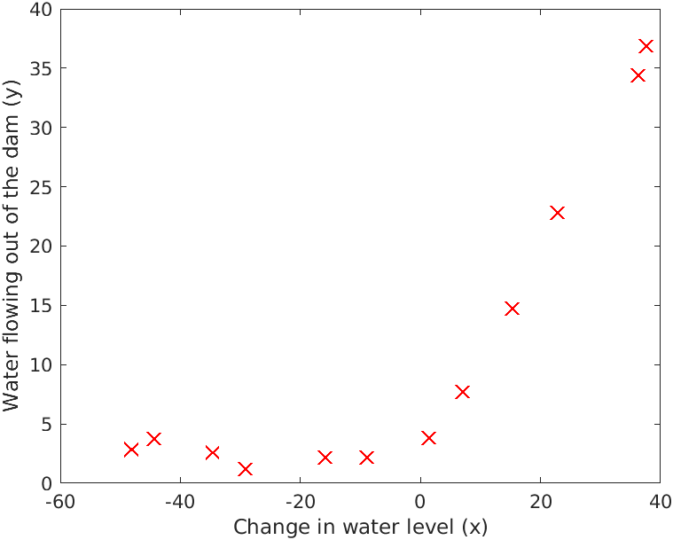
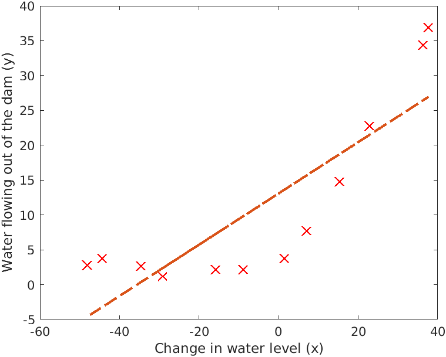
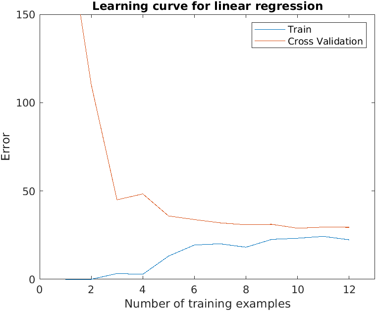
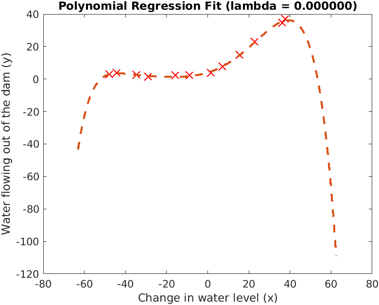
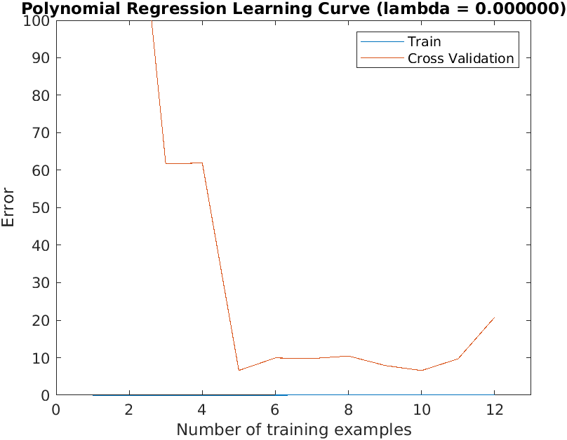

# Day 26- Bias and Variance

### Project Description
To implement regularized linear regression and use it to study models with different bias-variance properties.

## Regularized Linear Regression
Implement regularized linear regression to predict the amount of water flowing out of a dam using the change of water level in a reservoir.

### Visualizing the dataset
Begin by visualizing the dataset containing historical records on the change in the water level, x, and the amount of water flowing out of the dam, y.
This dataset is divided into three parts:
* A training set that your model will learn on: X, y
* A cross validation set for determining the regularization parameter: Xval, yval
* A test set for evaluating performance. These are \unseen" examples which your model did not see during training: Xtest, ytest

##### Figure 1- Plot of Training Data

### Regularized linear regression cost function
Next, the regularized linear regression cost function was calculated using `theta` initialized at [1; 1] in `linearRegCostFunction.m.`.

### Regularized linear regression gradient
Next, the gradient was calculated, returning it in the variable `grad`initialized at [1; 1] in `linearRegCostFunction.m.`.

### Fitting linear regression
Function in `trainLinearReg.m` is used to compute the optimal values of &theta;. This training function uses `fmincg` to optimize the cost function. 
The  `bias_variance.m` script uses `plotFit.m` to plot the best fit line

##### Figure 2- Linear Fit

The best fit line tells us that the model is not a good fit to the data because the data has a non-linear pattern.

## Bias-variance
An important concept in machine learning is the bias-variance tradeoff. Models with high bias are not complex enough for the data and tend to underfit, while models with high variance overfit to the training data.

### Learning curves
A learning curve plots training and cross validation error as a function of training set size. To plot the learning curve, we need a training and cross validation set
error for different training set sizes.
The `trainLinearReg` function finds the &theta; parameters. After learning the &theta; parameters, compute the error on the training and cross validation sets in `learningCurve.m` which will return a vector of errors for the training set and cross validation set. Print the learning curves and produce a plot.

##### Figure 3- Linear regression learning curve

It is observed that both the train error and cross validation error are high when the number of training examples is increased. This reflects a high bias problem in the model - the linear regression model is too simple and is unable to fit our dataset well.

## Polynomial regression
The problem with the linear model was that it was too simple for the data and resulted in underfitting (high bias). Thus, this problem was tried to be fixed by adding more features.
The `polyFeatures` function maps the original training set X of size m x 1 into its higher powers. After that, they are applied to the training set, the test set, and the
cross validation set.

### Learning Polynomial Regression
After the `polyFeatures` function map features to a higher dimension, we proceed to train polynomial regression using linear regression cost function since even though we have polynomial terms in our feature vector, we are still solving a linear regression optimization problem. The polynomial terms have simply turned into features that we can use for linear regression. 

Before learning the parameters &theta; for the polynomial regression,  `featureNormalize` will normalize the features of the training set, storing the `mu`, `sigma` parameters separately.

After that two plots are generated for polynomial regression with &lambda; = 0.
  

##### Figure 4- Polynomial fit, &lambda; = 0

From Figure 4, it is observed that the polynomial fit is able to follow the datapoints very well - thus, obtaining a low training error. However, the polynomial fit is very complex and even drops off at the extremes. This is an indicator that the polynomial regression model is overfitting the training data and will not generalize well. 

##### Figure 5- Polynomial learning curve, &lambda; = 0

From Figure 5, it is observed that the learning curve shows the same effect where the low training error is low, but the cross validation error is high. There is a gap between the training and cross validation errors, indicating a high variance problem.

### Project Structure
 `bias_variance.m` - Octave/MATLAB script to set up the dataset for the problem and make calls to user-defined functions.
  
#### User-Defined Function files
1. `data1.mat` - Dataset
1. `featureNormalize.m` - Feature normalization function
1. `fmincg.m` - Function minimization routine 
2. `plotFit.m` - Plot a polynomial fit
3. `trainLinearReg.m` - Trains linear regression using cost function
4. `linearRegCostFunction.m` - Regularized linear regression cost function
5. `learningCurve.m` - Generates a learning curve
6. `polyFeatures.m` - Maps data into polynomial feature space
7. `validationCurve.m` - Generates a cross validation curve

### How to run?
You can run project either in `octave` or `MATLAB`. 
1. Clone repository using `git clone `
2. `cd` to project directory and either run following command in `octave` or `MATLAB`
2. `run('bias_variance.m')` to run this project

### Where to find help?
* If you do not have Octave installed, please refer to the installation instructions on the [Octave Download](https://www.gnu.org/software/octave/download.html) official site.
* At the Octave/MATLAB command line, typing `help` followed by a function name displays documentation for a built-in function. For example, `help plot` will bring up help information for plotting. Further documentation for Octave functions can be found at the [Octave documentation pages](https://octave.org/doc/v5.2.0/). 
* MATLAB is a proprietary software but see if your school/university has a [MATLAB campus license](https://in.mathworks.com/academia/tah-support-program/eligibility.html). 
* MATLAB documentation can be found at the [MATLAB documentation pages](https://in.mathworks.com/help/matlab/?refresh=true).
