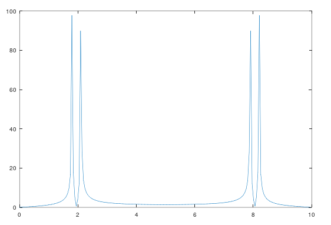

# Audio Frequency

#### About project

This project plot a signal that contains beat phenomenon and then analyze the signal's frequency content.

Audio signals are usually composed of many different frequencies. For example, in music, the note 'middle C' has a frequency of 261.6 Hz, and most music consists of several notes (or frequencies) being played at the same time.
Typically, the frequencies that make up a signal are different enough that they do not interfere substantially with each other.
However, when a signal contains two frequencies that are close together, they can cause the signal to appear to have a 'beat' - a pulsing pattern in the amplitude.

This project introduces graph visualization functions `plot` and other audio signal processing functions like `fft` with examples.

Signal's Frequency Graph

#### Project structure
* `audio_frequency.m` file plots signal frequency data on graph

#### How to run?
You can run project either in octave or MATLAB. 
1. Clone repository using `git clone `
2. `cd` to project directory and either run following command in octave or MATLAB
3. `run('audio_frequency.m')` to run `audio_frequency.m`

This project is part of MathWorks's [MATLAB Onramp Course](https://matlabacademy.mathworks.com/R2018b/portal.html?course=gettingstarted) | [Project Tutorial](https://matlabacademy.mathworks.com/R2018b/portal.html?course=gettingstarted#chapter=10&lesson=2&section=1)
