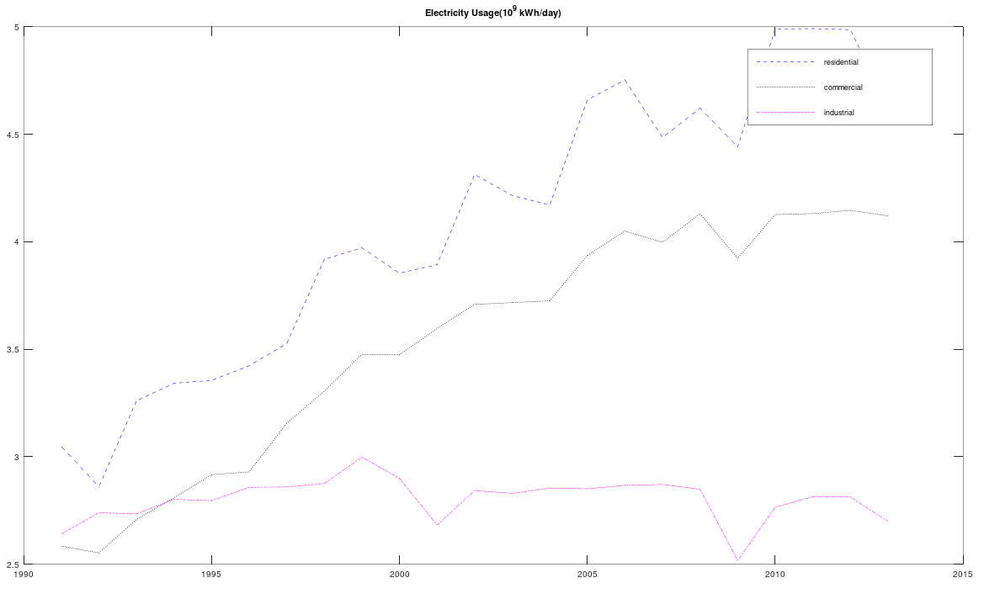
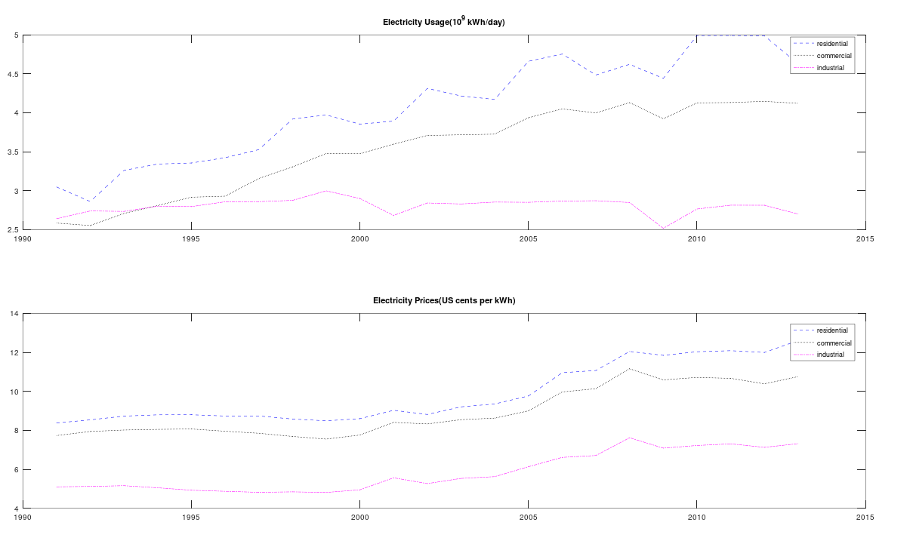

# Electricity Usage

#### About project

This project plot electricity usage and prices for various economic sectors - residential, commercial, and industrial. The usage data represents the US electricity consumption for different years in the month of July. The usage data are in _10^9 kWh/day_, and the price data is in US _cents per kWh_.

This project introduces graph visualization functions `plot` and `subplot` with examples.

Electricity Usage Graph

Electricity Usage-Prices Graph

#### Project structure
* `electricity.mat` file contains data
* `usage.m` file plots electricity usage data on graph
* `usage_prices.m` file plots electricity usage and prices on graph using `subplot`

#### How to run?
You can run project either in octave or MATLAB. 
1. Clone repository using `git clone `
2. `cd` to project directory and either run following command in octave or MATLAB
2. `run('usage.m')` to run `usage.m`
3. `run('usage_prices.m)` to run `usage_prices.m`

This project is part of MathWorks's [MATLAB Onramp Course](https://matlabacademy.mathworks.com/R2018b/portal.html?course=gettingstarted) | [Project Tutorial](https://matlabacademy.mathworks.com/R2018b/portal.html?course=gettingstarted#chapter=10&lesson=1&section=1)
