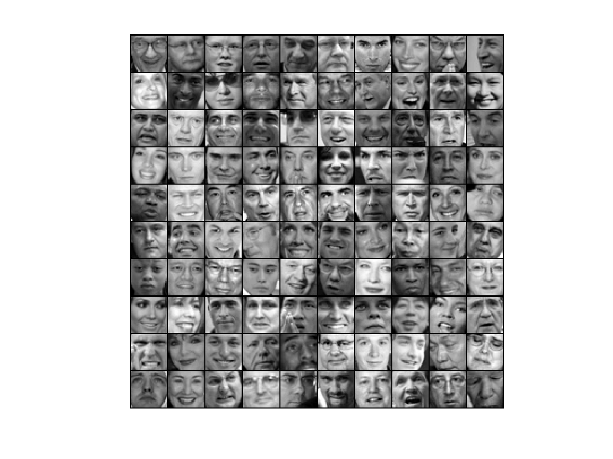
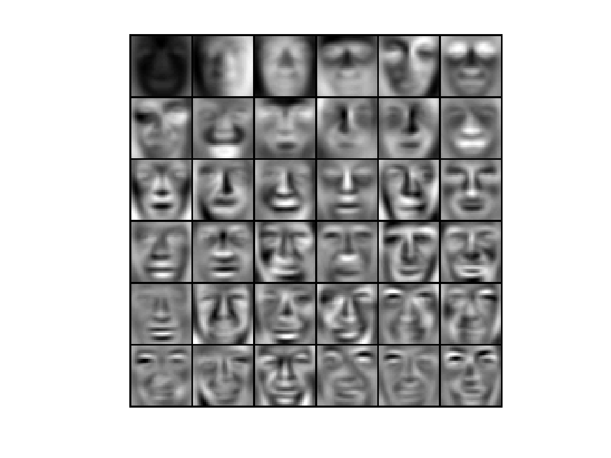
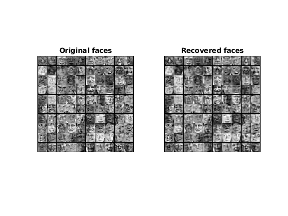
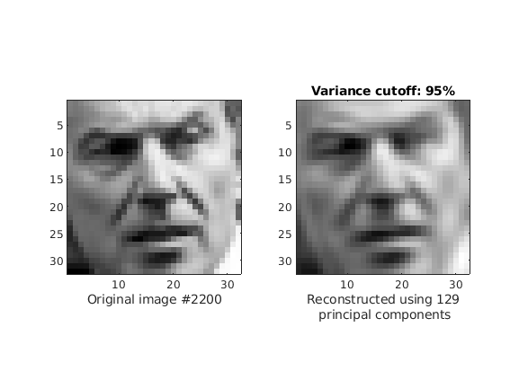

## Day 40 Project - Facial images dimensionality reduction and reconstruction using PCA

### Project Description
In this project, principal component analysis is used to find a low-dimensional representation of face images.

### Visualizing the Dataset
The dataset `faces.mat` contains a dataset X of face images, each 32x32 in grayscale. Each row of X corresponds to one face image (a row vector of length 1024).
First we load and visualize the first 100 of these face images.

###### Figure 1: Faces dataset 100 images

#### Normalizing the Data
Before using PCA, it is important to first normalize the data by subtracting the mean value of each feature from the dataset, and scaling each dimension so that they are in the same range. This normalization has been performed using the `featureNormalize` function.

#### Implementing PCA

After normalizing the data, you PCA is implemented to compute the principal components. PCA consists of two computational steps: First, the covariance matrix of the data is computed.
Then, compute the eigenvectors. These will correspond to the principal components of variation in the data. In MATLAB, you can run [SVD](https://in.mathworks.com/help/matlab/ref/double.svd.html;jsessionid=64febdc9692bf5fa4f55284eb168) to compute U1, U2, ... ,Un with the following command: [U, S, V] = svd(Sigma), where U will contain the principal components and S will contain a diagonal matrix.

After running PCA, the principal components of the dataset are obtained. Each principal component in U (each row) is a vector of length n (where for the face dataset,n = 1024). 
These principal components can be visualised by reshaping each of them into a 32x32 matrix that corresponds to the pixels in the original dataset. 

Below, the first 36 principal components that describe the largest variations have been displayed

###### Figure 2: Principal components on the face dataset

#### Dimensionality Reduction
After computing the principal components for the face dataset, it is used to reduce the feature dimension of the face dataset by projecting each example onto a lower dimensional space, x(i) -> z(i). This allows the use of the learning algorithm with a smaller input size (e.g., 100 dimensions) instead of the original 1024 dimensions. This can help speed up the learning algorithm.

#### Projecting the data onto the principal components
The function `projectData` projects each example in X (the dataset) onto the top (the desired number of dimensions to reduce to) K components in U (the principal components).
Here, t is used to project the face dataset onto only the first 100 principal components. Concretely, each face image is now described by a vector z(i) belongs to R100.

#### Reconstructing an approximation of the data
After projecting the data onto the lower dimensional space, the data is approximately recovered by projecting them back onto the original high dimensional space. The function  `recoverData` projects each example in `Z` back onto the original space and return the recovered approximation in `X_rec`.

Below, an approximate recovery of the data is performed and the original and projected face images are displayed side by side. 

     
###### Figure 3: Original images of faces and ones reconstructed from only the top 100 principal components.

From the reconstruction, it is observed that the general structure and appearance of the face are kept while the fine details are lost. 
This is a remarkable reduction (more than 10x) in the dataset size that can help speed up your learning algorithm significantly.

### Varying principal components
The following figure shows results after displaying more principal components to see how they capture more details and measure their variance.
For an image resconstructed using 129 principal components, the variance cutoff was found out to be 95%.

     
###### Figure 4: Original image of face and one reconstructed.

### Project Structure 

 `main_pca.m` - Octave/MATLAB script to set up the dataset for the problem and make calls to user-defined functions for the image compression using PCA

* data1.mat - Example Dataset for PCA
* faces.mat - Faces Dataset
* displayData.m - Displays 2D data stored in a matrix
* drawLine.m - Draws a line over an exsiting figure
* pca.m - Perform principal component analysis
* projectData.m - Projects a data set into a lower dimensional space
* recoverData.m - Recovers the original data from the projection

### How to run?
You can run project either in `octave` or `MATLAB`. 
1. Clone repository using `git clone `
2. `cd` to project directory and either run following command in `octave` or `MATLAB`
2. `run('main_pca.m')` to run this project

### Where to find help?
* If you do not have Octave installed, please refer to the installation instructions on the [Octave Download](https://www.gnu.org/software/octave/download.html) official site.
* At the Octave/MATLAB command line, typing `help` followed by a function name displays documentation for a built-in function. For example, `help plot` will bring up help information for plotting. Further documentation for Octave functions can be found at the [Octave documentation pages](https://octave.org/doc/v5.2.0/). 
* MATLAB is a proprietary software but see if your school/university has a [MATLAB campus license](https://in.mathworks.com/academia/tah-support-program/eligibility.html). 
* MATLAB documentation can be found at the [MATLAB documentation pages](https://in.mathworks.com/help/matlab/?refresh=true).

