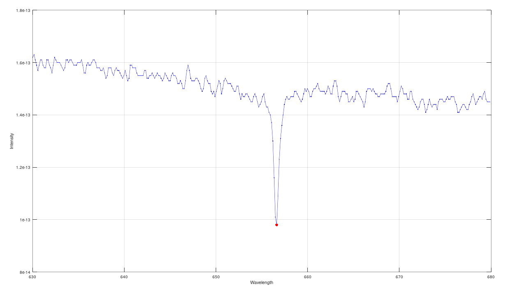

# Stellar Motion

#### About project

This project finds the determine how fast the star is moving away from earth by using the wavelength characteristic spectrum of star.

One can learn about a star -- thousands of mile years away from the earth -- by examining the light which comes from the star. The beam of light can be split into its individual wavelength using _diffraction grating_. Measuring the intensity of light observed in each wavelength gives the _star characteristic spectrum_. As H2(Hydrogen) obsorbs light precisely at _656.3 nm_, there is deep spike in spectrum in almost all star's characteristic spectrum. A star's spectrum is _blueshifted_ shifted to shorter wavelengths if it's moving towards earth and _redshifted_, shifted to longer wavelengths if it's moving away from earth. 

This project finds the obsorbed wavelength of the hydrogen alpha line of HD94028 star and compare this wavelength to known wavelength to determine how fast the star HD94028 is moving away from earth.

Above theory is visually explained in detail on [MathWorks course curriculum](https://matlabacademy.mathworks.com/R2018b/portal.html?course=gettingstarted#chapter=14&lesson=1&section=1).

Characteristic spectrum of star HD94028

#### Project structure
* `stellar_motion.m` file plots signal frequency data on graph
* `spectrum_data.mat` file contains spectrum of different star in different columns. The data for star HD94028 is in sixth column.

#### How to run?
You can run project either in octave or MATLAB. 
1. Clone repository using `git clone `
2. `cd` to project directory and either run following command in octave or MATLAB
3. `run('stellar_motion.m')` to run `stellar_motion.m`

Change the variable `star_no_to_evaluate` in `stellar_motion.m` script, to evaluate different star's spectrum provided in `spectrum_data.mat` file.

This project is part of MathWorks's [MATLAB Onramp Course](https://matlabacademy.mathworks.com/R2018b/portal.html?course=gettingstarted) | [Project Tutorial](https://matlabacademy.mathworks.com/R2018b/portal.html?course=gettingstarted#chapter=14&lesson=1&section=1)
