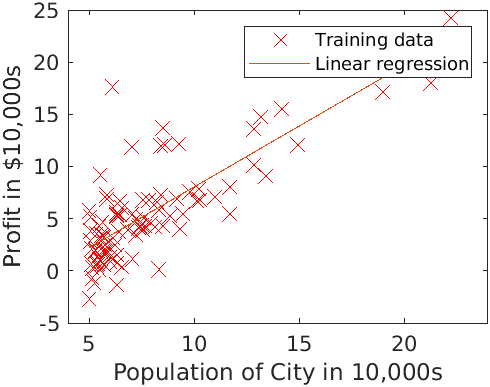

# Day 5 - Linear Regression Project

### Problem Statement
In this project I implemented linear regression with one variable to predict profits for a restaurant franchise which is considering different cities for opening a new
outlet. The chain already has outlets in various cities and data for profits and populations from the cities is provided. The goal to find which city is appropriate to expand to next.

The file `ex1data1.txt` contains the dataset for the above linear regression problem. The first column is the population of a city and the second column is the profit of a food truck in that city. A negative value for profit indicates a loss.

### Plotting the Data
Before starting on any task, it is often useful to understand the data by visualizing it. For this dataset, I have used a scatter plot to visualize the data, since it has only two properties to plot (profit and population). In `restaurant_linear_regression_1.m`, the dataset is loaded from the data file and then the script calls the `plotData` function to create a scatter plot of the data.

### Gradient Descent
Next, I fit the linear regression parameters &theta; to the dataset using batch gradient descent algorithm (minimize cost function J(&theta;)). Final values for &theta; were also be used to make predictions on profits in areas of 35,000 and 70,000 people. The script calls the file `computeCost.m`, which is a function that computes J(&theta;) and `gradientDsecent.m` to implement the algorithm.

###### Figure 1- Training data with linear regression fit

### Visualising J(&theta;)

User-Built Function files
1. `plotData.m` - Function to display the dataset
1. `computeCost.m` - Function to compute the cost of linear regression
1. `gradientDescent.m` - Function to run gradient descent

#### How to run?
You can run project either in `octave` or `MATLAB`. 
1. Clone repository using `git clone `
2. `cd` to project directory and either run following command in octave or MATLAB
2. `run('restaurant_linear_regression_1.m')` to run this project.

