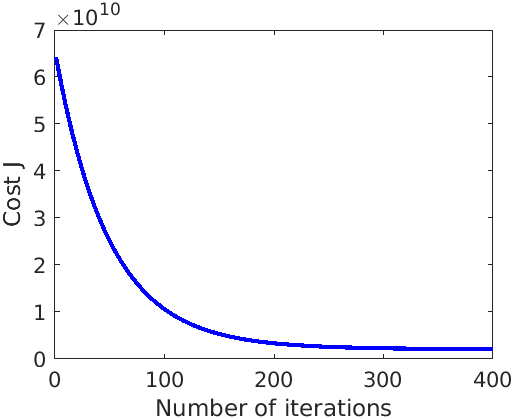

# Day 6 - Linear Regression Project 2

### Project Desciption
In this project I implemented linear regression with multiple variables to predict the prices of houses to find a good market price to sell a house. One way to do this is to first collect information on recent houses sold and make a model of housing prices.

The file `ex1data2.txt` contains a training set of housing prices in Portland, Oregon. The first column is the size of the house (in square feet), the second column is the number of bedrooms, and the third column is the price of the house.

### Plotting the Data
Before starting on any task, it is often useful to understand the data by visualizing it. For this dataset, I have used a scatter plot to visualize the data, since it has only two properties to plot (profit and population). In `restaurant_linear_regression_1.m`, the dataset is loaded from the data file and then the script calls the `plotData` function to create a scatter plot of the data.

### Gradient Descent
Next, I fit the linear regression parameters &theta; to the dataset using batch gradient descent algorithm (minimize cost function J(&theta;)). Final values for &theta; were also be used to make predictions on profits in areas of 35,000 and 70,000 people. The script calls the file `computeCostmulti.m`, which is a function that computes J(&theta;) and `gradientDsecentmulti.m` to implement the algorithm.

###### Figure 1 - Convergence of gradient descent with an appropriate learning rate

### Project Structure 

`prices_of_house_multivariant_regression.m` - Octave/MATLAB script to set up the dataset for the problem and make calls to user-defined functions.

User-Defined Function files
1. `plotData.m` - Function to display the dataset
1. `computeCostmulti.m` - Function to compute the cost of linear regression
1. `gradientDescentmulti.m` - Function to run gradient descent

### How to run?
You can run project either in `octave` or `MATLAB`. 
1. Clone repository using `git clone `
2. `cd` to project directory and either run following command in `octave` or `MATLAB`
2. `run('prices_of_house_multivariant_regression.m')` to run this project

### Where to find help?
* If you do not have Octave installed, please refer to the installation instructions on the [Octave Download](https://www.gnu.org/software/octave/download.html) official site.
* At the Octave/MATLAB command line, typing `help` followed by a function name displays documentation for a built-in function. For example, `help plot` will bring up help information for plotting. Further documentation for Octave functions can be found at the [Octave documentation pages](https://octave.org/doc/v5.2.0/). 
* MATLAB is a proprietary software but see if your school/university has a [MATLAB campus license](https://in.mathworks.com/academia/tah-support-program/eligibility.html). 
* MATLAB documentation can be found at the [MATLAB documentation pages](https://in.mathworks.com/help/matlab/?refresh=true).
