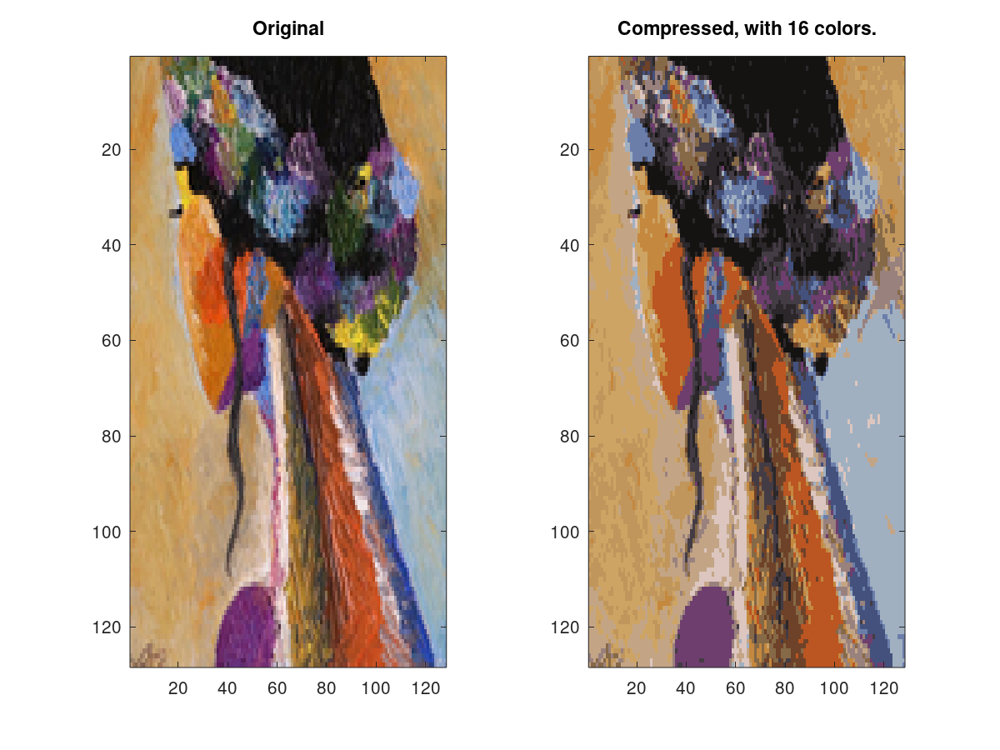
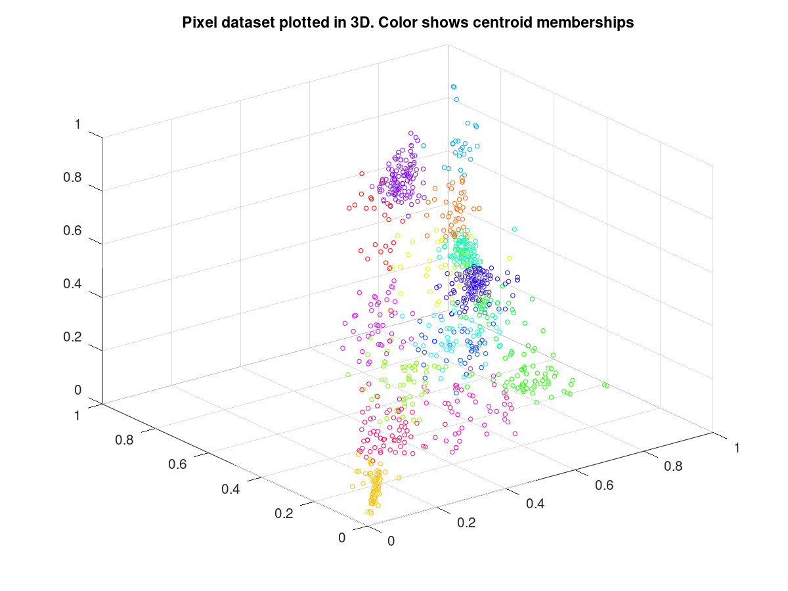
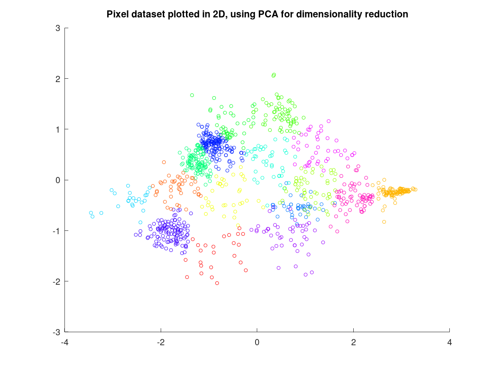
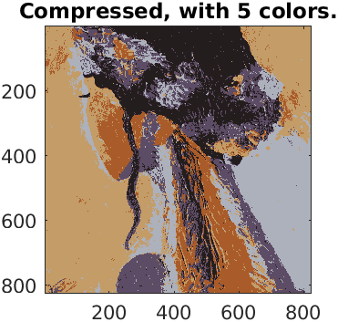
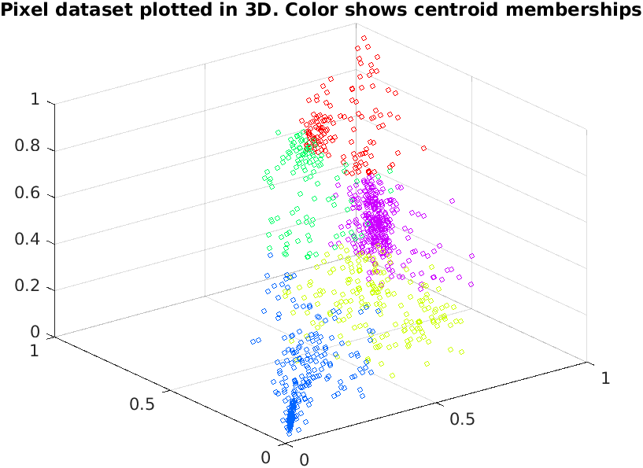
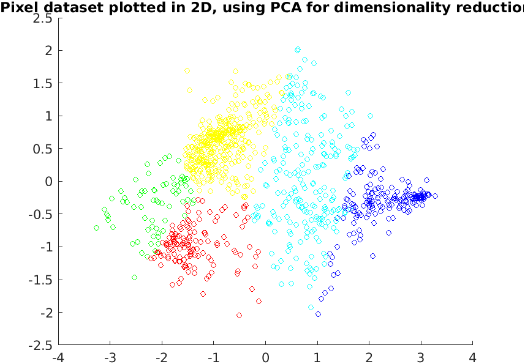
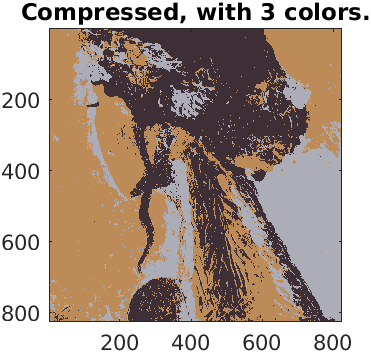
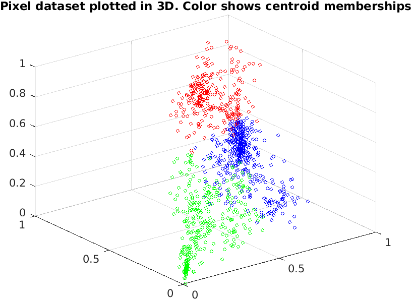
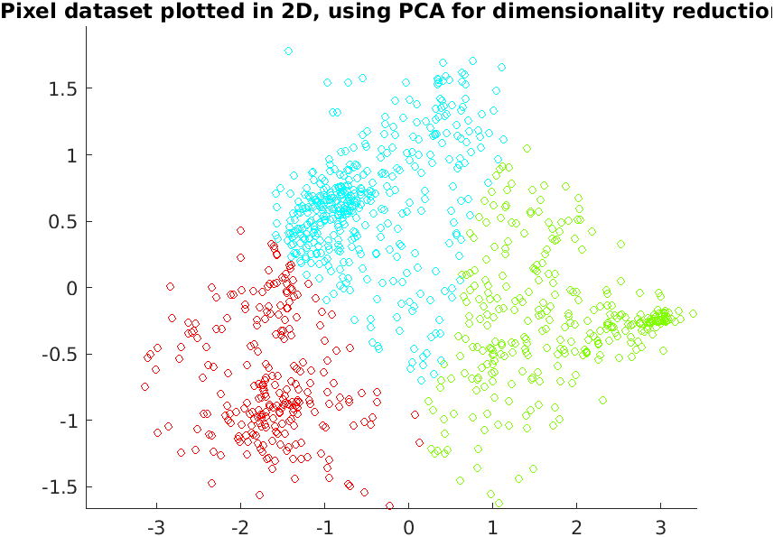
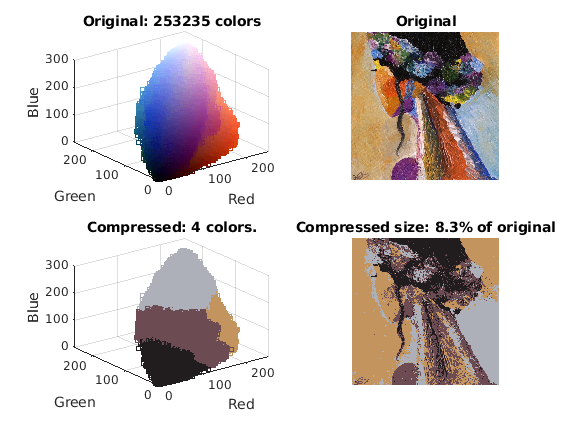

## Day 40 Project - Image Compression using k-means algorithm, clustering, pca

### Project Description
Implement the K-means clustering algorithm and apply it to compress an image. The K-means algorithm is used for image compression by reducing the number of colors that occur in an image to only those that are most common in that image.

### Implementing K-means
The K-means algorithm is a method to automatically cluster similar data examples together. The intuition behind K-means is an iterative procedure that starts by guess-
ing the initial centroids, and then refines this guess by repeatedly assigning examples to their closest centroids and then recomputing the centroids based on the assignments.

#### Finding closest centroids
In the "cluster assignment" phase of the K-means algorithm, the algorithm assigns every training example x(i) to its closest centroid, given the current positions of centroids. The `findClosestCentroids.m` function takes the data matrix `X` and the locations of all centroids inside `centroids` and should output a one-dimensional array `idx` that holds the index (a value in {1......K}, where K is total number of centroids) of the closest centroid to every training example.

#### Computing centroid means
Given assignments of every point to a centroid, the second phase of the algorithm recomputes, for each centroid, the mean of the points that were assigned to it. The script `main_imagecompression.m` will call the function in `computeCentroids.m` and output the centroids after the first step of K-means.

### Image compression with K-means
In a straightforward 24-bit color representation of an image (Figure 1) each pixel is represented as three 8-bit unsigned integers (ranging from 0 to 255) that specify the red, green and blue intensity values. This encoding is often refered to as the RGB encoding. The image contains thousands of colors, the task is to reduce the number of colors to 16 colors.
By making this reduction, it is possible to represent (compress) the photo in an efficient way. Specifically, you only need to store the RGB values of the 16 selected colors, and for each pixel in the image you now need to only store the index of the color at that location (where only 4 bits are necessary to represent 16 possibilities).

###### Figure 1: The original 128x128 image.

Here, the K-means algorithm is used to select the 16 colors that will be used to represent the compressed image. Concretely, every pixel in the original image is treated as a data example and the K-means algorithm is used to find the 16 colors that best group (cluster) the pixels in the 3-dimensional RGB space. Once the cluster centroids on
the image are computed, the 16 colors are used to replace the pixels in the original image.

#### K-means of Pixels
The `main_imagecompression.m` script first loads the image, and then reshapes it to create an mx3 matrix of pixel colors (where m = 16384 = 128 x 128), and calls the K-means function on it.
After finding the top K = 16 colors to represent the image, each pixel position is assigned to its closest centroid using the `findClosestCentroids` function. This represents the original image using the centroid assignments of each pixel.

###### Figure 2: Original and reconstructed image (when using K-means to compress the image).

Finally, the effects of the compression can be viewed by reconstructing the image based only on the centroid assignments. Specifically, you can replace each pixel location with the mean of the centroid assigned to it. Figure 2 shows the reconstruction we obtained. Even though the resulting image retains most of the characteristics of the original, we also see some compression artifacts.

### PCA for visualization

Next, the final pixel assignments in this 3D space are visualized using the `scatter3` function. Each data point is colored according to the cluster it has been assigned to.

###### Figure 3: Compressed 16 colors data in 3D 

It turns out that visualizing datasets in 3 dimensions or greater can be cumbersome. Therefore, it is often desirable to only display the data in 2D even at the cost of losing some information. In practice, PCA is often used to reduce the dimensionality of data for visualization purposes.

Thus lastly, implementation of PCA is done to the 3-dimensional data to reduce it to 2 dimensions and visualize the result in a 2D scatter plot. The PCA projection can be thought of as a rotation that selects the view that maximizes the spread of the data, which often corresponds to the "best" view.

###### Figure 4: 2D visualization produced using PCA

### Varying K to see the effects on the compression

Below figure shows the effect of image compression after compressing the image to having only 5 colors.

###### Figure 5: Reconstructed image for K = 5 .

###### Figure 6: Compressed 5 colors data in 3D 

###### Figure 7: 2D visualization produced using PCA

Below figure shows the effect of image compression after compressing the image to having only 3 colors.

###### Figure 8: Reconstructed image for K = 3 .

###### Figure 9: Compressed 3 colors data in 3D 

###### Figure 10: 2D visualization produced using PCA

Below figure shows the effect of image compression after compressing the image to having only 4 colors in comparison to the original image 253235 colors.

###### Figure 11: Graphic Representation and Comparsion of Original vs Reconstructed image for K = 4 .

### Project Structure 

 `main_imagecompression.m` - Octave/MATLAB script to set up the dataset for the problem and make calls to user-defined functions for the image compression using K-means

* data2.mat - Example Dataset for K-means
* girl.png - Example Image
* displayData.m - Displays 2D data stored in a matrix
* plotDataPoints.m - Initialization for K-means centroids
* plotProgresskMeans.m - Plots each step of K-means as it proceeds
* runkMeans.m - Runs the K-means algorithm
* pca.m - Perform principal component analysis
* projectData.m - Projects a data set into a lower dimensional space
* findClosestCentroids.m - Find closest centroids (used in K-means)
* computeCentroids.m - Compute centroid means (used in K-means)
* kMeansInitCentroids.m - Initialization for K-means centroids

### How to run?
You can run project either in `octave` or `MATLAB`. 
1. Clone repository using `git clone `
2. `cd` to project directory and either run following command in `octave` or `MATLAB`
2. `run('main_imagecompression.m')` to run this project

### Where to find help?
* If you do not have Octave installed, please refer to the installation instructions on the [Octave Download](https://www.gnu.org/software/octave/download.html) official site.
* At the Octave/MATLAB command line, typing `help` followed by a function name displays documentation for a built-in function. For example, `help plot` will bring up help information for plotting. Further documentation for Octave functions can be found at the [Octave documentation pages](https://octave.org/doc/v5.2.0/). 
* MATLAB is a proprietary software but see if your school/university has a [MATLAB campus license](https://in.mathworks.com/academia/tah-support-program/eligibility.html). 
* MATLAB documentation can be found at the [MATLAB documentation pages](https://in.mathworks.com/help/matlab/?refresh=true).

