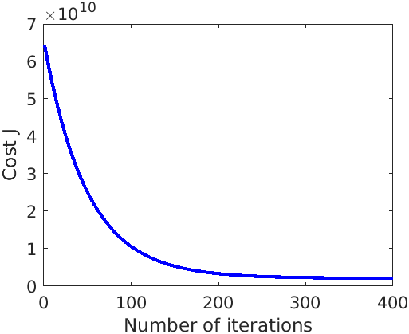

# Day 6 - Linear Regression Project 2

### Project Description
In this project I implemented linear regression with multiple variables to predict the prices of houses to find a good market price to sell a house. One way to do this is to first collect information on recent houses sold and make a model of housing prices.

The file `data.txt` contains a training set of housing prices in Portland, Oregon. The first column is the size of the house (in square feet), the second column is the number of bedrooms, and the third column is the price of the house.

### Feature Normalization
The `prices_of_house_multivariant_regression.m` script will start by loading and displaying some values from the dataset. By looking at the values, we find that house sizes are about 1000 times the number of bedrooms. Since the features differ by orders of magnitude, I first performed feature scaling to make gradient descent converge much more quickly.  The script calls the file `featureNormalize` to normalize the features.

### Gradient Descent
Next, I fit the linear regression parameters &theta; to the dataset using batch gradient descent algorithm (minimize cost function J(&theta;)). Final values for &theta; were also be used to to predict the price of a house with 1650 square feet and 3 bedrooms. The script calls the file `computeCostmulti.m`, which is a function that computes J(&theta;) and `gradientDescentmulti.m` to implement the algorithm.

###### Figure 1 - Convergence of gradient descent with an appropriate learning rate

### Normal Equation
Normal equation is the closed-form solution to linear regression. I also found out the results using this method. The script calls the file `normalEqn` to find the closed form solution without the need of feature scaling.

### Project Structure 

`prices_of_house_multivariant_regression.m` - Octave/MATLAB script to set up the dataset for the problem and make calls to user-defined functions.

User-Defined Function files
1. `featureNormalize.m` - Function to normalize features
1. `computeCostmulti.m` - Cost function for multiple variables
1. `gradientDescentmulti.m` - Gradient descent for multiple variables
1. `normalEqn.m` - Function to compute the normal equations

### How to run?
You can run project either in `octave` or `MATLAB`. 
1. Clone repository using `git clone `
2. `cd` to project directory and either run following command in `octave` or `MATLAB`
2. `run('prices_of_house_multivariant_regression.m')` to run this project

### Where to find help?
* If you do not have Octave installed, please refer to the installation instructions on the [Octave Download](https://www.gnu.org/software/octave/download.html) official site.
* At the Octave/MATLAB command line, typing `help` followed by a function name displays documentation for a built-in function. For example, `help plot` will bring up help information for plotting. Further documentation for Octave functions can be found at the [Octave documentation pages](https://octave.org/doc/v5.2.0/). 
* MATLAB is a proprietary software but see if your school/university has a [MATLAB campus license](https://in.mathworks.com/academia/tah-support-program/eligibility.html). 
* MATLAB documentation can be found at the [MATLAB documentation pages](https://in.mathworks.com/help/matlab/?refresh=true).
