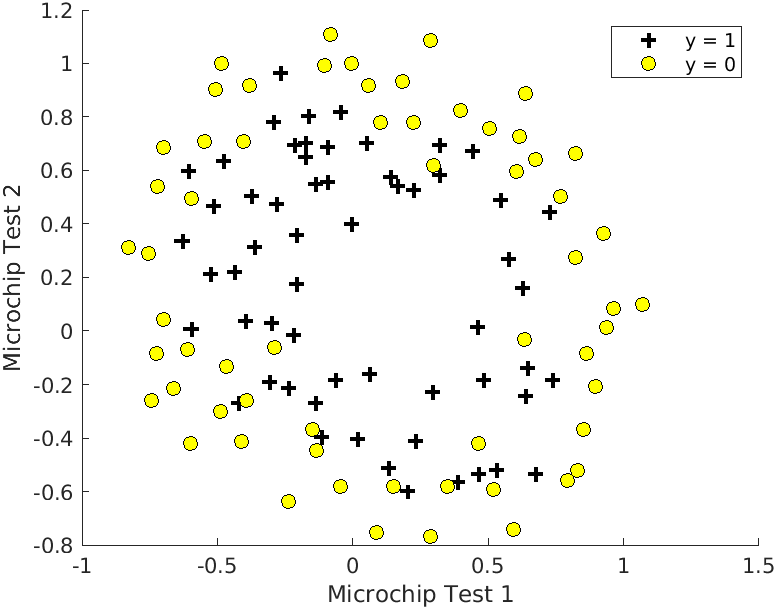
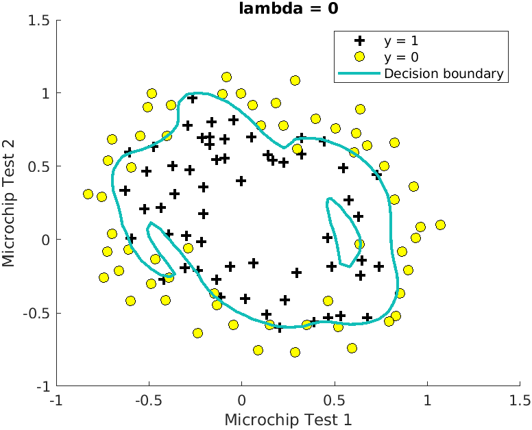
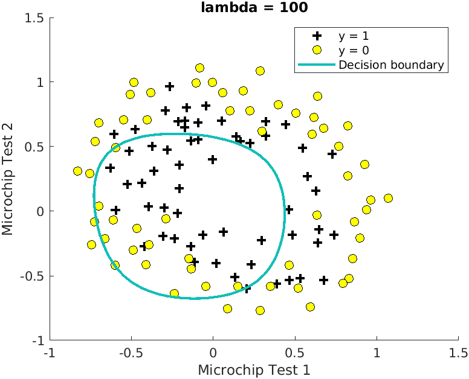
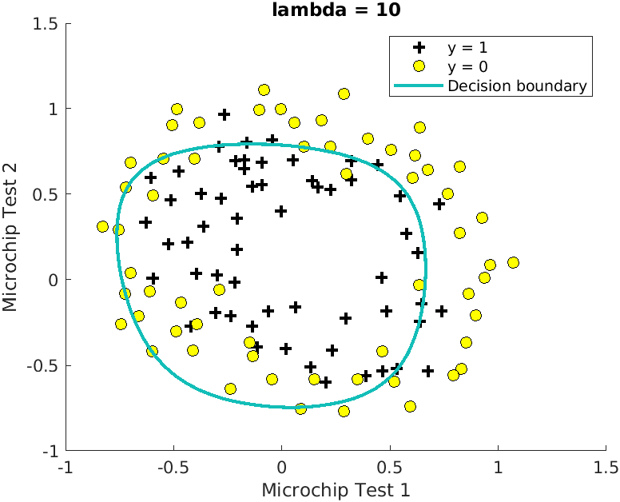
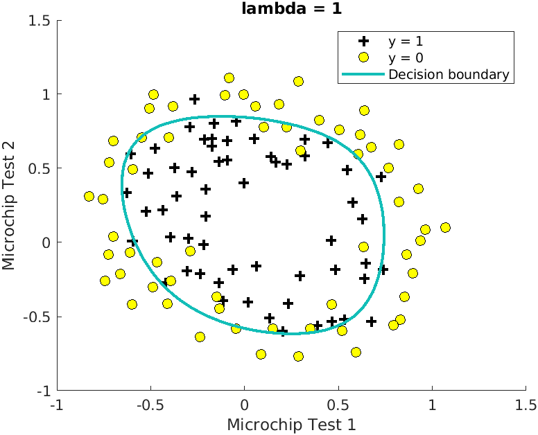

# Day 11 - Regularized Logistic Regression Project 2

### Project Description
In this project, I implemented regularized logistic regression to predict whether microchips from a fabrication plant passes quality assurance (QA) based on the test results for some microchips on two different tests. From these tests, we would like to determine whether the microchips should be accepted or rejected.

The file  contains historical data from previous applicants. The first column is the exam 1 score, the second column is the score of exam 2 and the third column is the the admissions decision. Zero indicates not admitted while one indicates admitted students.

### Plotting the Data
Before starting to implement any learning algorithm, it is often useful to understand the data by visualizing it. For this dataset, I have used a scatter plot to visualize the data. In `microchip_prediction.m`, the dataset is loaded from the data file `microchipdata.txt` and then the script calls the `plotData` function to create a scatter plot of the data.

##### Figure 1- Scatter Plot of training data

Figure 1 shows that the dataset cannot be separated into positive and negative examples by a straight-linethrough the plot. Therefore, a straightforward application of logistic regression will not perform well on this dataset since logistic regression will only be able to find a linear decision boundary.

### Feature Mapping
One way to fit the data better is to create more features from each data point. In the provided function `mapFeature.m`, I mapped the features into all polynomial terms of x1 and x2 up to the sixth power.
This is because a logistic regression classifier trained on this higher-dimension feature vector will have a more complex decision boundary and will appear nonlinear when drawn in our 2-dimensional plot.
As a result of this mapping, our vector of two features (the scores on two QA tests) has been transformed into a 28-dimensional vector. A logistic
regression classifier trained on this higher-dimension feature vector will have a more complex decision boundary and will appear nonlinear when drawn in our 2-dimensional plot.
While the feature mapping allows us to build a more expressive classifier, it also more susceptible to overfitting.
 
### Cost function and gradient
Now you will implement code to compute the cost function and gradient for regularized logistic regression. `costFunctionReg.m` returns the cost and gradient which are then called in `microchip_prediction.m` to compute them.

#### Learning parameters using `fminunc`
After computing the cost and gradient for regularized logistic regression, `fminunc` is used to learn the optimal parameters (&theta;).

### Plotting the decision boundary
To visualize the model learned by this classifier, the function `plotDecisionBoundary.m` is used which plots the (non-linear) decision boundary that separates the positive and negative examples. In `plotDecisionBoundary.m`, the non-linear decision boundary is plotted by computing the classifier's predictions on an evenly spaced grid and then and a contour plot of where the predictions change from y = 0 to y = 1 is drawn.

### Understanding Overfitting
Next, different regularization parameters are tried to understand how regularization prevents overfitting.

* Case 1: With a very small &lambda;, the classifier gets almost every training example correct, but draws a very complicated boundary, thus overfitting the data.

##### Figure 2- Scatter Plot of Overfitting case

* Case 2: With a very large &lambda;, the decision boundary will not follow the data so well, thus underfitting the data

##### Figure 3- Scatter Plot of Underfitting case

Trying out other cases for &lambda; 

##### Figure 4- Scatter Plot of &lambda; = 10 case

* Optimal Case- With a &lambda; between 0 to 10, you should see a plot that shows an simpler decision boundary which still separates the positives and negatives fairly well.

##### Figure 5- Scatter Plot of &lambda; = 1 case

### Project Structure 

`microchip_prediction.m` - Octave/MATLAB script to set up the dataset for the problem and make calls to user-defined functions.

User-Defined Function files
1. `plotData.m` - Function to plot 2D classification data
1. `costFunctionReg.m` - Function to compute the cost of logistic regression
1. `plotDecisionBoundary.m` - Function to plot classifier's decision boundary 
1. `predict.m` - Logistic regression prediction function
1. `mapFeature.m` - Function to generate polynomial features

### How to run?
You can run project either in `octave` or `MATLAB`. 
1. Clone repository using `git clone `
2. `cd` to project directory and either run following command in `octave` or `MATLAB`
2. `run('microchip_prediction.m')` to run this project

### Where to find help?
* If you do not have Octave installed, please refer to the installation instructions on the [Octave Download](https://www.gnu.org/software/octave/download.html) official site.
* At the Octave/MATLAB command line, typing `help` followed by a function name displays documentation for a built-in function. For example, `help plot` will bring up help information for plotting. Further documentation for Octave functions can be found at the [Octave documentation pages](https://octave.org/doc/v5.2.0/). 
* MATLAB is a proprietary software but see if your school/university has a [MATLAB campus license](https://in.mathworks.com/academia/tah-support-program/eligibility.html). 
* MATLAB documentation can be found at the [MATLAB documentation pages](https://in.mathworks.com/help/matlab/?refresh=true).

