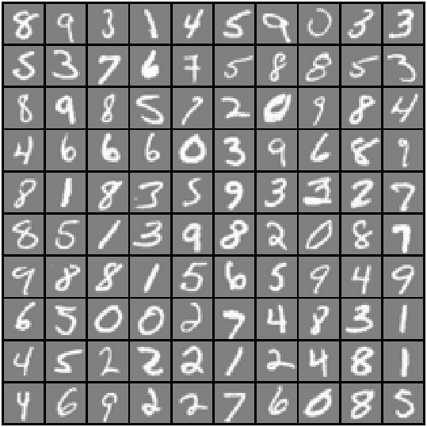

# Day 17 - Multi-classification Neural Network Project 1 (Handwriting Recognition)

### Project Description
Implement feedforward propagation algorithm to use weights for prediction of hand-written digits.

The file `data1.mat` contains the dataset for the above neural network problem. The dataset is a subset of the [MNIST handwritten digit dataset](http://yann.lecun.com/exdb/mnist/) that contains 5000 training examples of handwritten digits.
The `weights.mat` contains the parameters of the neural network.

### Visualizing the data and Model Representation
Before starting on any task, it is often useful to understand the data by visualizing it. For this dataset, load and display the data on a 2-dimensional plot by calling the function `displayData`.

###### Figure 1- Display 100 examples from the dataset

### Model representation
The neural network has 3 layers (an input layer, a hidden layer and an output layer). Since the images are of size 20 x 20, this gives us 400 input layer units. 
The parameters (Theta1 and Theta2) have dimensions that are sized for a neural network with 25 units in the second layer and 10 output units (corresponding to the 10 digit classes).

###### Figure 2- Neural Network Model

### Feedforward Propagation and Prediction
Implement the feedforward computation that computes h &theta; (x (i) ) for every example i and returns the associated predictions. Similar to the [one-vs-all classification strategy](https://github.com/kritanjalijain/ML_from_Scratch/tree/master/Multi-Classification_Logistic_Regression), the prediction from the neural network will be the label that has the largest output (h &theta; (x (i) )) k 

### Results
The training accuracy is about 97.5%.

### Project Structure 

`handwriting_recognition_2.m` - Octave/MATLAB script to set up the dataset for the problem and make calls to user-defined functions.

User-Defined Function files
1. `displayData.m` - Function to help visualize the dataset
1. `predict.m` - Neural Network Prediction Function
1. `sigmoid.m` - Sigmoid function

### How to run?
You can run project either in `octave` or `MATLAB`. 
1. Clone repository using `git clone `
2. `cd` to project directory and either run following command in `octave` or `MATLAB`
2. `run('handwriting_recognition_2.m')` to run this project

### Where to find help?
* If you do not have Octave installed, please refer to the installation instructions on the [Octave Download](https://www.gnu.org/software/octave/download.html) official site.
* At the Octave/MATLAB command line, typing `help` followed by a function name displays documentation for a built-in function. For example, `help plot` will bring up help information for plotting. Further documentation for Octave functions can be found at the [Octave documentation pages](https://octave.org/doc/v5.2.0/). 
* MATLAB is a proprietary software but see if your school/university has a [MATLAB campus license](https://in.mathworks.com/academia/tah-support-program/eligibility.html). 
* MATLAB documentation can be found at the [MATLAB documentation pages](https://in.mathworks.com/help/matlab/?refresh=true).

