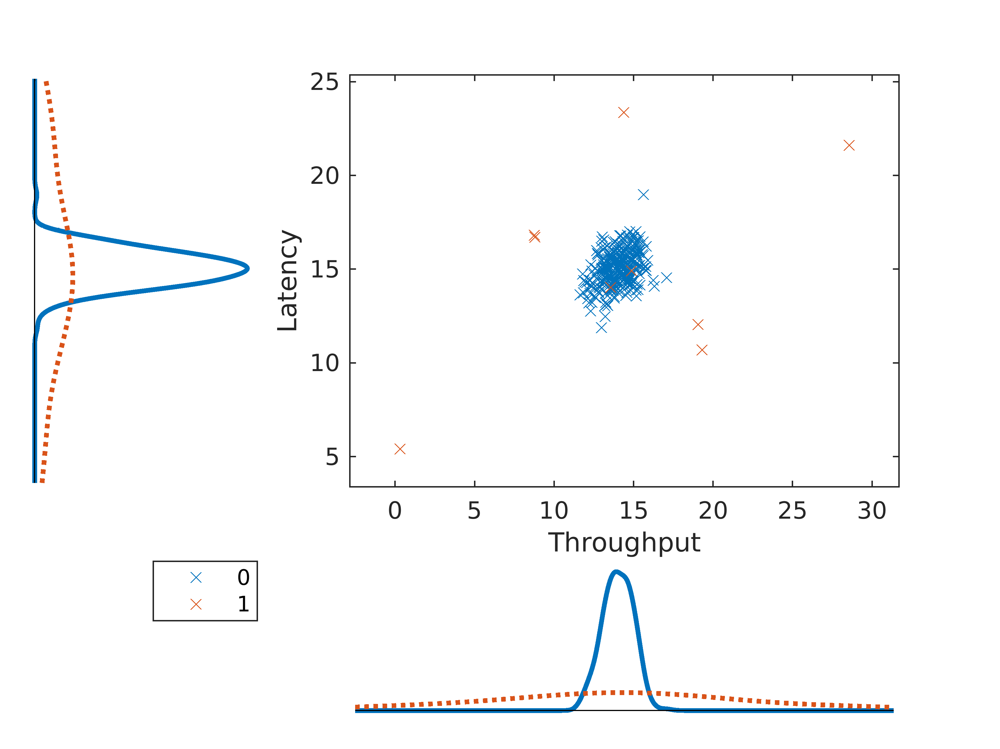
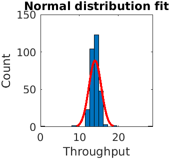
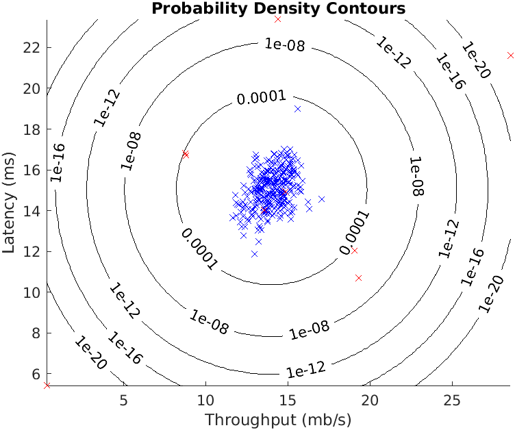
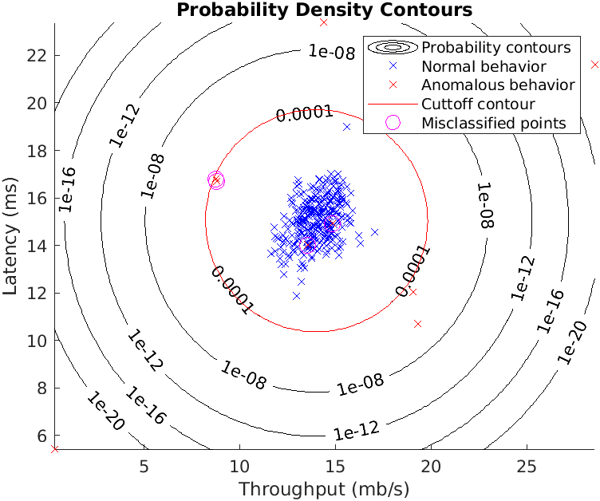
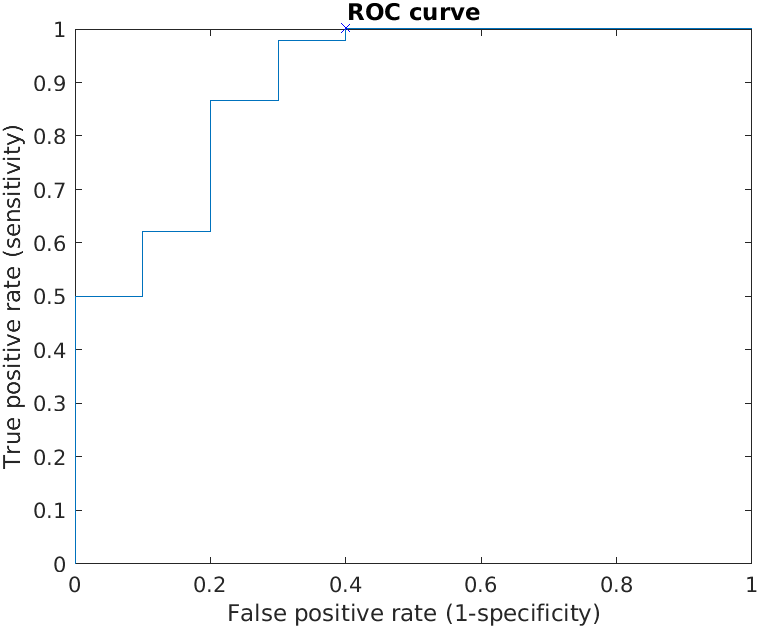

# Day 42 - Anomaly Detection 

### Project Description
Implement an anomaly detection algorithm to detect anomalous behavior in server computers. 

The algorithm detects failing servers on a network. The features measure the throughput (mb/s) and latency (ms) of response of each server. First a sample `data1.mat` unlabeled dataset containing 307 examples of how the serves were behaving during operation is used to visualize and test the algorithm. After testing, the anomaly detection
algorithm is applied to a larger dataset with many dimensions.

### Visualizing the data
Before fitting a distribution to data, it's helpful to visualize the data to see what existing probability distributions might make for a reasonable fit. The visualized 2D dataset looks as the figure given below

     
###### Figure 1: Sample 2D dataset

From the resulting plot, the 'normal behavior' observations appears approximately normally distributed with most observations concentrated symmetricaly about the mean. The 'anomalous behavior' observations appear more evenly distributed over the range of variable values and also appear symmetrically distributed about the overall means, however there are considerably fewer anomalous observations.

Next, the normal distribution fit is visualize using the `histfit` function, which plots a histogram of the data and the fitted distribution.

     
###### Figure 2: Normal Distribution

### Gaussian distribution
To perform anomaly detection, first the model is fit to the data's distribution. This is done using the Gaussian function.

### Estimating parameters for a Gaussian
The `estimateGaussian.m` function takes as input the data matrix X and outputs an n-dimension vector that holds the mean of all the n features and another n-dimension vector
that holds the variances of all the features.

Next the contours of the fitted Gaussian distribution are visualized.

     
###### Figure 3: The Gaussian distribution contours of the distribution fit to the dataset

From your plot, it is seen that most of the examples are in the region with the highest probability, while the anomalous examples are in the regions with lower probabilities.

### Selecting the threshold
The low probability examples are more likely to be the anomalies in our dataset. One way to determine which examples are anomalies is to select a threshold based on a cross validation set. The `selectThreshold.m` functions implements an algorithm to select the threshold using the F1 score on a cross validation set. The F1 score depends on the precision and recall values, which in turn depend on the true positive, false positive, and false negative counts. The function returns two values; the first is the selected threshold and second is the F1 score, which tells us how well we doing on finding the ground truth anomalies given a certain threshold.
After that, the anomalies are visualised by circling them in the plot.

     
###### Figure 4: The classified anomalies

### High dimensional dataset
After running the anolmaly detection algorithm on this smaller dataset and testing its accuracy, the anomaly detection algorithm is implemented on a more realistic and much harder dataset. In this dataset, each example is described by 11 features, capturing many more properties of the computer servers. 

The Gaussian parameters (mean and variance-sqaured) are estimated, the probabilities are evaluated for both the training data X from which the Gaussian parameters were estimated, and for the the cross-validation set Xval. Finally, the best threshold is found and displayed along with the number of anomalies found.

A more general alternative to the F1 score is found by using performance curves to select cutoff values. The idea behind performance curves is as follows: for a set of probability scores S obtained from a machine learning model and a (sequential) set of probability cuttoff values, plot the values of the performance statistics. This plot called a performance curve and it provides a visual means to track the performance of a classifier as judged by the given metrics as the cutoff is varied. The most common performance statistics are the false positive rate and true positive rates. A performance curve generated using these two statistics is commonly known as a Receiver Operating Characteristic (ROC) curve.

Below is the ROC curve of the anomaly detection algorithm

     
###### Figure 5: The ROC Curve 

### Project Structure 

`anodetect.m` - Octave/MATLAB script to set up the dataset for the problem and make calls to user-defined functions.

User-Defined Function files

* `data1.mat` - First example Dataset for anomaly detection
* `data2.mat` - Second example Dataset for anomaly detection

1. `estimateGaussian.m` - Estimate the parameters of a Gaussian distribution with a diagonal covariance matrix
1. `selectThreshold.m` - Find a threshold for anomaly detection
2. `multivariateGaussian.m` - Computes the probability density function for a Gaussian distribution 
3. `visualizeFit.m` - 2D plot of a Gaussian distribution and a dataset

### How to run?
You can run project either in `octave` or `MATLAB`. 
1. Clone repository using `git clone `
2. `cd` to project directory and either run following command in `octave` or `MATLAB`
2. `run('anodetect.m')` to run this project

### Where to find help?
* If you do not have Octave installed, please refer to the installation instructions on the [Octave Download](https://www.gnu.org/software/octave/download.html) official site.
* At the Octave/MATLAB command line, typing `help` followed by a function name displays documentation for a built-in function. For example, `help plot` will bring up help information for plotting. Further documentation for Octave functions can be found at the [Octave documentation pages](https://octave.org/doc/v5.2.0/). 
* MATLAB is a proprietary software but see if your school/university has a [MATLAB campus license](https://in.mathworks.com/academia/tah-support-program/eligibility.html). 
* MATLAB documentation can be found at the [MATLAB documentation pages](https://in.mathworks.com/help/matlab/?refresh=true).

